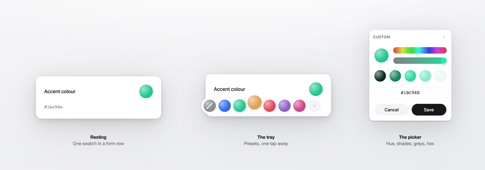
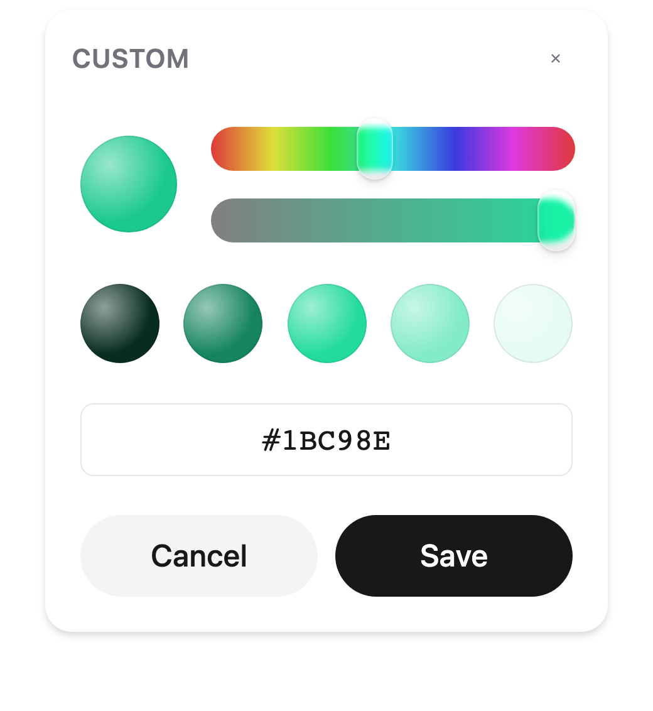
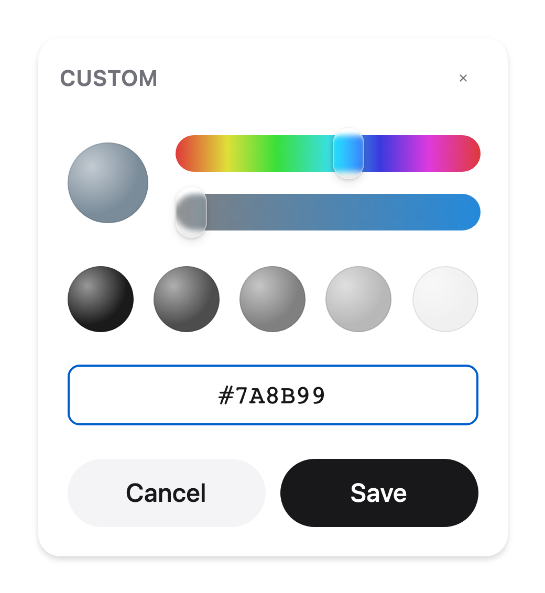
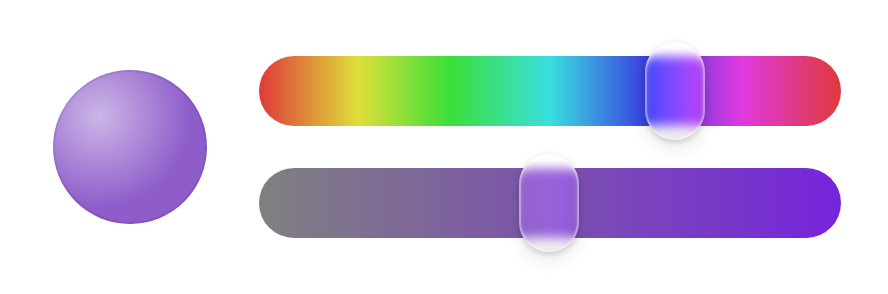
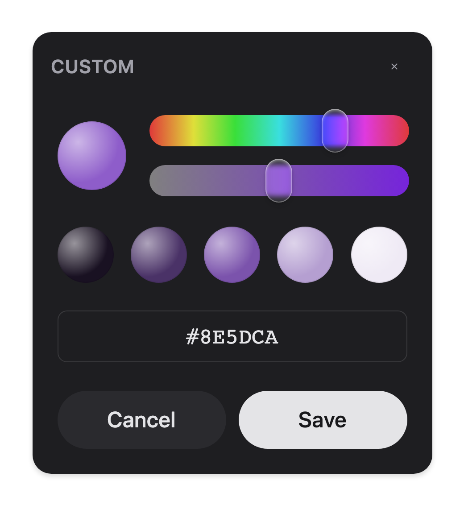

# vue-tray-color-picker

[](https://github.com/fabkho/vue-tray-color-picker/actions/workflows/ci.yml)
[](https://www.npmjs.com/package/vue-tray-color-picker)
[](./LICENSE)

An opinionated Vue 3 colour picker. A floating tray puts the common colours one
tap away; behind the `+` is a full picker — hue, shades, greys and hex — built so
that every colour a user can reach is one worth shipping.



**[Try it →](https://fabkho.github.io/vue-tray-color-picker/)**

Most pickers are an HSV square, which will happily hand back `#8B7355`, or a
fixed palette with nowhere to go when none of the swatches fit. This one gives
you a hue and five usable shades of it, and a full range with hex entry for when
you need an exact value.

## Install

```sh
npm i vue-tray-color-picker
```

```ts
import { ColorPicker } from 'vue-tray-color-picker'
import 'vue-tray-color-picker/style.css'
```

The stylesheet is a separate import on purpose: nothing is injected, so load
order stays yours.

## Usage

```vue
<script setup lang="ts">
import { ref } from 'vue'
import { ColorPicker } from 'vue-tray-color-picker'

const color = ref<string | null>('#1bc98e')
</script>

<template>
  <ColorPicker v-model="color" />
</template>
```

Surface and theme colours need greys and exact values:

```vue
<ColorPicker v-model="background" range="full" clearable default-value="var(--surface)" />
```



## What it does not do

- **No alpha channel.** Hex in, hex out, fully opaque.
- **No colour spaces beyond sRGB hex.** An OKLCH ladder would give perceptually
  even shades across hues and is the most promising future change, but it would
  alter which colours are reachable.

## How the ladder works

Three axes: a continuous hue, a three-step saturation scale, and a five-rung
lightness ladder. `range="identity"` (the default) keeps to the legible middle
and pins saturation to vivid — for an entity's own colour, where every reachable
value has to work as a label and a chart series. `range="full"` reaches toward
black and white and unlocks the greyscale rung plus hex entry.

**The ring tells the truth.** It marks the rung whose colour *is* the current
value, compared exactly. Open the picker on something the ladder cannot express
— a muted slate, a near-grey, most brand palettes — and no rung is ringed,
because none of them is that colour. Pointing at the nearest one would claim a
colour the preview does not show. Touch any control and the ring appears and
stays.

Opening the picker never rewrites your value. Save without touching anything and
you get back exactly what you passed in, byte for byte.



<sub>`#7A8B99` is not on the ladder, so nothing claims to be it.</sub>

The band's thumb is frosted rather than solid: it samples the band beneath and
carries a wash of the colour it is sitting on.



## Bringing your own floating layer

`ColorPopover` is the default and the designated swap-out point. `ColorSurface`
works standalone — render it in your own dropdown, a modal, or inline:

```vue
<MyDropdown>
  <ColorSurface v-model="color" range="full" @close="close" />
</MyDropdown>
```

Nothing else in the package depends on `ColorPopover`.

## Theming

Every visual value resolves through three tiers, first match wins:

1. `--vtcp-*` — this component
2. `--ui-*` — your design system, adopted by anything reading the same names
3. a literal default, so it looks right with no theme at all

```css
:root {
  --vtcp-radius: 0.25rem;
  --vtcp-swatch-size: 1.75rem;
}
```

| Property | Default |
| --- | --- |
| `--vtcp-surface` | `light-dark(#fff, #1e1e21)` |
| `--vtcp-text` | `light-dark(#18181b, #e4e4e7)` |
| `--vtcp-text-muted` | `light-dark(#71717a, #a1a1aa)` |
| `--vtcp-border` | `light-dark(rgb(0 0 0 / 10%), rgb(255 255 255 / 12%))` |
| `--vtcp-shadow` | `0 3px 6px rgb(0 0 0 / 15%)` |
| `--vtcp-radius` | `0.75rem` |
| `--vtcp-duration` | `340ms` |
| `--vtcp-ease` | a sampled spring, one soft overshoot |
| `--vtcp-swatch-size` | `2.25rem` |
| `--vtcp-gap` | `0.625rem` |
| `--vtcp-surface-muted` | `light-dark(#f4f4f6, #2a2a2e)` |
| `--vtcp-primary` / `--vtcp-primary-text` | `light-dark(#18181b, #e4e4e7)` / inverted |
| `--vtcp-tray-gap` / `--vtcp-tray-padding` | `0.5rem` / `0.375rem` |
| `--vtcp-glass-blur` | `20px` — set to `0` for a flat pill |
| `--vtcp-glass-surface` | `light-dark(rgb(255 255 255 / 92%), rgb(30 30 30 / 92%))` |
| `--vtcp-glass-border` | `light-dark(rgb(210 214 222 / 40%), rgb(255 255 255 / 8%))` |
| `--vtcp-glass-shadow` | a soft ambient shadow |
| `--vtcp-burst-step` | `-3.25rem` — how far the swatches fly in from |
| `--vtcp-band-height` | `1.25rem` |
| `--vtcp-thumb-width` / `--vtcp-thumb-height` | `1.0625rem` / `1.75rem` |
| `--vtcp-thumb-radius` | `0.6rem` |
| `--vtcp-thumb-blur` | `3px` — the band's frost |
| `--vtcp-thumb-fill` | `rgb(255 255 255 / 10%)` |

The tray is a translucent pill with a backdrop blur, and its swatches burst in
staggered from the trigger. Both are the point rather than decoration, but
`--vtcp-glass-blur: 0` gives a flat pill if the blur is too expensive or reads
badly over a busy background, and `prefers-reduced-motion` removes the burst.

The band's thumb is frosted rather than solid: `backdrop-filter` samples the
band beneath it, so it carries a wash of the colour it is sitting on and changes
hue as you drag. Where `backdrop-filter` is unsupported it falls back to a
translucent white body.

**Dark mode** is `light-dark()` against the inherited `color-scheme`. There is no
class or data-attribute convention to adopt — but you do need to declare
`color-scheme` somewhere above the picker, or it resolves light:

```css
:root { color-scheme: light dark; }
```

It is deliberately not declared on the component: that would override a host
forcing one scheme on purpose.



Motion is suppressed under `prefers-reduced-motion` by the package's own
stylesheet.

## API

### `<ColorPicker>`

| Prop | Type | Default | |
| --- | --- | --- | --- |
| `modelValue` | `string \| null` | `null` | Hex, or null for unset |
| `suggestions` | `ColorSuggestion[]` | six presets | One-tap swatches |
| `defaultValue` | `string` | `#2b6af8` | Shown while unset; may be a CSS variable |
| `range` | `'identity' \| 'full'` | `'identity'` | |
| `commit` | `'confirm' \| 'immediate'` | `'confirm'` | `immediate` drops the footer and writes as you move |
| `clearable` | `boolean` | `false` | Offers a swatch that unsets the value |
| `disabled` | `boolean` | `false` | |
| `placement` | `Placement` | `'bottom-start'` | |
| `recentKey` | `string \| null` | `'vtcp:recent'` | Scope per field; `null` disables persistence |
| `recentLimit` | `number` | `3` | |
| `labels` | `Partial<ColorPickerLabels>` | English | Every user-facing string |

Emits `update:modelValue` with a hex string, or `null` when cleared.

The prop shape is exported as `ColorPickerProps`, so a wrapper can extend it
without restating it — along with `Placement`, which the `placement` prop
borrows from Floating UI:

```ts
import type { ColorPickerProps, Placement } from 'vue-tray-color-picker'

interface BrandPickerProps extends ColorPickerProps {
  fallbackPlacement?: Placement
}
```

### `<ColorSurface>`

The panel alone: `modelValue`, `range`, `commit`, `disabled`, `labels`,
`saveClass`, `cancelClass`. Emits `update:modelValue` and `close`.

### Replacing the footer buttons

Two routes, depending on how far you need to go. For a restyle, pass your own
classes — they land on the default buttons alongside ours:

```vue
<ColorPicker v-model="color" save-class="a-btn a-btn--primary" cancel-class="a-btn" />
```

For different markup entirely, take the `#actions` slot. It replaces the footer
and hands you the handlers:

```vue
<ColorPicker v-model="color">
  <template #actions="{ save, cancel, value }">
    <MyButton @click="cancel">Discard</MyButton>
    <MyButton primary @click="save">Use {{ value }}</MyButton>
  </template>
</ColorPicker>
```

Both are available on `ColorPicker` and on `ColorSurface`.

### `<ColorPopover>`

The floating layer: `open` (v-model), `placement`, `gap`, `disabled`. Slots
`#trigger="{ open, toggle, triggerAttrs }"` and `#default="{ close }"`.

### Colour maths

`hexToHsl`, `hslToHex`, `isHex`, `expandHex`, `shadesFor`, `resolveAxes`,
`nearestStepIndex`, `lightnessSteps`, and the step tables — all pure, all
exported, usable without the components.

## Accessibility

Both swatch groups are radio groups: one tab stop, arrows move and select, Home
and End reach the ends. The floating layer traps Tab, closes on Escape and on an
outside click, and returns focus to the trigger. Every swatch has a name — a
preset's label, or its hex for a mixed colour.

## Contributing

See [CONTRIBUTING.md](./CONTRIBUTING.md).

## Licence

MIT
